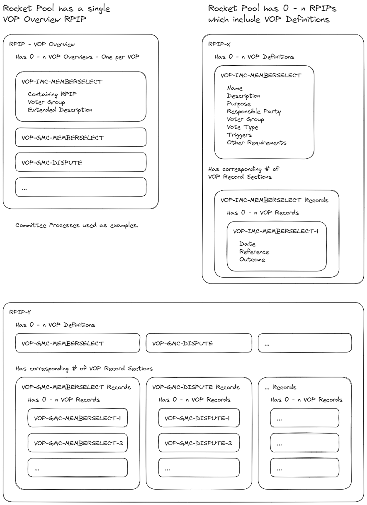

## Abstract
Abstract is a multi-sentence (short paragraph) technical summary. This should be a very terse and human-readable version of the specification section. Someone should be able to read only the abstract to get the gist of what this specification does.

$TODO

## Motivation

The creation of an operational process framework will lead to reduced participant cost, increased transparency and increased extensibility for DAO operational decision-making.

**Reduced Cost**

First, the types of process that exist can be listed, summarized and presented in such a way that is more-approachable to the average participant than reading through multiple full RPIPs. Participant attention is a key resource. If all that is needed is a high-level overview of 'how does process x work in Rocket Pool', then attention should not need to be spent digging through low-level details unless required.

Second, votes and discussions can be labelled explicitly according to the process they are using. This makes it easier for participants to quickly slot items into the appropriate mental boxes. Essentially, it becomes easier for voters and participants to tailor their level of engagement with the seriousness of the decision at hand. For example:
* An RPIP is important, because it now always represents a change to the status quo rather than an operational decision. "I should pay attention!"
* A GMC election doesn't represent a change to how Rocket Pool works, but its important to set general direction of grants spending via membership. "I might provide some input!"
* A grants appeal can be more safely left to those with more time / interest in low-level grants decisions. "Other parts of my life take priority right now!"

Thirdly, this also levels the playing field for participants with different levels of committment. There is a reduced need to understand many subtly different processes. Instead there is a general framework makes engagement with any process less of a mental hurdle once the framework is understood.

**Transparency**

The outcomes of processes can be recorded in a clear, consistent and accessible manner. This is worthwhile in and of itself, but it does also reduce the attention and mental effort required to find relevant information.

**Extensibility**

Adoption of an operational process framework helps to structure the processes of the Rocket Pool DAOs in such a way that they are easily extensible in future improvement proposals. The motivation here is to encourage organization, transparency and accessibility in such a way that it becomes self-sustaining. If there is a clear existing structure in use, then it encourages its use in future RPIPs.

## Specification
$TODO Remove
The key words “MUST”, “MUST NOT”, “REQUIRED”, “SHALL”, “SHALL NOT”, “SHOULD”, “SHOULD NOT”, “RECOMMENDED”, “MAY”, and “OPTIONAL” in this document are to be interpreted as described in RFC 2119.

### VOPs: What and When?
This section describes what a VOP is, and when to use the VOP framework.

* A Voted Operational Process (VOP) is a process involving a vote through which an operational decision is made.
  * Some operational decisions within the Rocket Pool DAOs MAY NOT require a vote, and therefore are not included in the VOP framework.
* A VOP MUST NOT be defined to cover decisions that are improvements to the Rocket Pool protocol, Rocket Pool DAOs, or anything that should otherwise require use of the RPIP process.
* The dividing line between which decisions should use the RPIP process versus the VOP framework may be unavoidably blurry. The following general recommendations are made:
  * If a proposal can reasonably predicted to be unique, it is RECOMMENDED to use the RPIP process.
  * If a proposal is the first of its type or class, and it is not anticipated to repeat frequently or regularly it is RECOMMENDED to use the RPIP process.
  * If a proposal is not the first of its type or class, or if it is anticipated to repeat frequently or regularly it is RECOMMENDED to use the VOP framework. 
* The VOP framework SHOULD be used for anything that fits the definition of a voted operational process. 
  * If an RPIP specifies a process that could reasonably fit within the VOP framework, without adhering to the VOP framework, it MUST include detailed rationale as to why adhering to the VOP framework is not preferable.

---

### VOP Visual Aid

 

---

### VOP Usage

### VOP Definitions
This section describes the concept of a VOP definition, and how to include one in an RPIP. 

A VOP definition contains the elements that make up a particular type of VOP.
> For example, the VOP-GMC-MEMBERSELECT definition describes how GMC elections take place.

A VOP definition MUST include the elements defined in the VOP Elements section of this specification.

A VOP definition SHOULD follow the template defined in the VOP Definition Template section of this specification.

If use of the VOP framework is deemed appropriate, a VOP definition MUST be included in the RPIP in which the process is described.

#### VOP Elements
This section defines what makes up a VOP definition.

* Code - A short, unique, human-readable string identifier that can be used to identify instances of this VOP. Should take the rough form of VOP-SUBJECT-ACTION
* Name - A longer identifier in plain english. 
* Description - A description of this VOP.
* Purpose - Why does this VOP definition exist?
* Responsible Party - What party is responsible for ensuring this VOP takes place when it is triggered?
* Voting Group - Which group votes on the outcome of this VOP?
* Vote Type - What platform and format does this vote use?
* Triggers - See section below
* Other Requirements - See section below

##### VOP Triggers
* An event or situation that triggers this VOP to take place.
* VOPs MAY have multiple triggers. 
  * Multiple triggers have an OR relationship unless specified otherwise: Any met trigger can result in a new VOP instance.
* Triggers are considered mandatory unless explicitly marked optional. 
  * 'At Will' is an exception to this, and is always to be considered optional. 
  * If a mandatory trigger condition is met, a responsible party SHOULD begin an instance of the VOP.

##### VOP Other Requirements
* A VOP MAY have more detailed requirements or prerequisites than can be easily summarized into the VOP definition format.
* Any requirements of this nature should be detailed under a specific heading in the same, or another RPIP. 
  * This heading should then be referenced in the VOP definition under 'Other Requirements'.

---

### VOP Instances
A VOP instance is an instanciation of a VOP definition. 
> For example, VOP-GMC-MEMBERSELECT-1 is a GMC election, with candidates, a vote, results, etc.

When a VOP instance is triggered, it SHALL be assigned the next free ID number by the responsible party.
  * ID numbers are unique per VOP definition, start at 1, and increment by 1. 
  * VOP ID's MUST be appended to the VOP code with a hyphen.

---

### VOP Records
A VOP record contains the result of a concluded VOP instance.
> For example, the results of VOP-GMC-MEMBERSELECT-1 formatted into the appropriate record section.

A VOP record section MUST be included in the RPIP in which a VOP is defined.
  * The VOP record section SHOULD follow the template defined in the VOP Record Template section of this specification.
  
When a VOP instance concludes, its outcome MUST be recorded in the appropriate VOP record section by the RPIP Editors. 
  * A VOP Record MUST include the date the VOP concluded.
  * A VOP Record MUST include an appropriate URL link indicating the outcome of the VOP.
  * A VOP Record MUST include a brief, human-readable summary of the outcome.

---

### VOP Overview
The VOP Overview is a summary of defined VOPs within Rocket Pool.
> For example, a Living informational RPIP that lists the currently defined VOPs and the RPIPs they are attached to.

A VOP Overview MUST exist as a living, informational RPIP maintained by the RPIP Editors.

Whenever an RPIP is ratified, the RPIP Editors MUST update the VOP Overview RPIP to include an entry for any newly ratified VOPs.
  * The VOP Overview entry SHOULD follow the template defined in the VOP Overview Entry Template section of this specification.

---

### VOP Common Requirements
This section lists requirements and common rules that apply to all usage of the VOP framework.

* The result of any VOP instance SHALL NOT be considered valid until it is made publicly accessible via the communication mediums commonly used by the Rocket Pool DAOs.

---

### VOP Templates and Examples
This section contains templates and examples to be used when interacting with the VOP framework.


#### VOP Definition Template
```
### <VOP CODE>
This is a voted operational process (VOP) definition, see RPIP-vop for more information.

* **Name:** 
* **Description:** 
* **Purpose:** 
* **Responsible Party:** 
* **Voting Group:** 
* **Vote Type:** 
* **Trigger(s):** 
  * 
  * 
  * 
* **Other Requirements:**   
  * 
  *
  *
```

##### VOP-EXAMPLE-EXAMPLE
This is a voted operational process (VOP) definition, see RPIP-vop for more information.

* **Name:** Voted Operational Process Example  
* **Description:** An example Voted Operational Process  
* **Purpose:** Demonstrate Voted Operational Process templates.  
* **Responsible Party:** RPIP Author  
* **Voting Group:** RPIP Author  
* **Vote Type:** Majority (Show of hands)  
* **Trigger(s):**   
  * Modification of RIP-vop structure.
  * When bored.
* **Other Requirements:** No other requirements


#### VOP Record Section Template

```
| Code                   | Date       | Reference           | Outcome                                     |
|------------------------|------------|---------------------|---------------------------------------------|
| VOP-CODE-1             | YYYY-MM-DD | [Link](outcome link)| Brief description of VOP outcome for record |
| VOP-CODE-2             | YYYY-MM-DD | [Link](outcome link)| Brief description of VOP outcome for record |

Note, table generators exist: https://www.tablesgenerator.com/markdown_tables#

```

##### VOP Record Section Example

| Code                   | Date       | Reference           | Outcome                                   |
|------------------------|------------|---------------------|-------------------------------------------|
| VOP-EXAMPLE-EXAMPLE-1  | 2023-10-03 | [Link](example.com) | The example was ratified to wide acclaim. |


#### VOP Overview Entry Template

```
#### VOP-EXAMPLE-EXAMPLE - <CONTAINING RPIP>
<VOP Extended Description>
```

##### VOP-EXAMPLE-EXAMPLE - [RPIP-VOP](RPIP-VOP.md)

This VOP is an example voter operational process that is intended to demonstrate how to define VOPs, describe VOPs, and record VOP instance outcomes. This VOP is just an example, so there's not really very much to say in this  overview! 

The intention is for overviews such as this to exist in a single informational RPIP that lists all defined VOPs that exist in the Rocket Pool DAOs. These descriptors will allow newcomers to the Rocket Pool community to easily identify common processes that take place at a high-level, and learn more about any they are interested in.

---

## Rationale
$TODO

The rationale fleshes out the specification by describing what motivated the design and why particular design decisions were made. It should describe alternate designs that were considered and related work, e.g. how the feature is supported in other languages.

## Backwards Compatibility

If this RPIP is ratified, existing ratified RPIPs containing processes that would fall under the VOP framework will be modified to use the VOP framework. The explicit intention is to maintain the logic and rules of existing processes, and just change their presentation such that they integrate with the VOP framework.

In case of unintentional changes to the logic of existing processes, or ambiguity introduced by the changes, RPIP Editors MAY modify the relevant RPIPs to _restore logical parity only_ without requiring a pDAO vote.  

The included processes are listed below, along with their VOP definitions. A PR has been prepared that will implement these changes. It will be merged by the RPIP Editors if this RPIP is ratified.

### VOP-GMC-MEMBERSELECT
This is a voted operational process (VOP) definition, see RPIP-vop for more information.

* **Name:** Grants Management Committee Selection
* **Description:** An election to fill the membership slots of the GMC.
* **Purpose:** Ensure that the pDAO has the opportunity to periodically vote on GMC membership.
* **Responsible Party:** GMC Administrator > GMC Members > RPIP Editors
* **Voting Group:** pDAO
* **Vote Type:** Weighted (Snapshot)
* **Trigger(s):** 
  * Periodic approximately yearly (between 10-14 months).
  * More than half of the GMC is membership has not been elected via vote.
  * There are vacant seats on the GMC that cannot be filled without a vote.
* **Other Requirements:**  See RPIP-10 - Management Committee Selection for full requirements.

### VOP-GMC-ADMINSELECT
This is a voted operational process (VOP) definition, see RPIP-vop for more information.

* **Name:** Grants Management Committee Administrator Selection  
* **Description:** Selection of a GMC Administrator by the GMC members.
* **Purpose:** Ensure that the GMC has an administrator.
* **Responsible Party:** GMC Members > RPIP Editors
* **Voting Group:** GMC Members
* **Vote Type:** Single Choice Majority (Committee Internal)
* **Trigger(s):** 
  * OPTIONAL - Periodic yearly (12 months)
  * The GMC Administrator role is unfilled
* **Other Requirements:** See RPIP-26 - Expanded GMC Administrator Role for full requirements.

### VOP-GMC-ADMINREMOVE
This is a voted operational process (VOP) definition, see RPIP-vop for more information.

* **Name:** Grants Management Committee Administrator Removal  
* **Description:** Removal of the GMC Administrator by the GMC members.
* **Purpose:** To ensure that an avenue exists to remove a current GMC Administrator.
* **Responsible Party:** GMC Members
* **Voting Group:** GMC Members
* **Vote Type:** Single Choice Majority (Committee Internal)
* **Trigger(s):** At will
* **Other Requirements:** No other requirements.

### VOP-IMC-MEMBERSELECT
This is a voted operational process (VOP) definition, see RPIP-vop for more information.

* **Name:** Incentives Management Committee Selection
* **Description:** An election to fill the membership slots of the IMC.
* **Purpose:** Ensure that the pDAO has the opportunity to periodically vote on IMC membership.
* **Responsible Party:** IMC Members > RPIP Editors
* **Voting Group:** pDAO
* **Vote Type:** Weighted (Snapshot)
* **Trigger(s):** 
  * Periodic approximately yearly (between 10-14 months).
  * More than half of the IMC is membership has not been elected via vote.
  * There are vacant seats on the IMC that cannot be filled without a vote.
* **Other Requirements:** See RPIP-10 - Management Committee Selection for full requirements.

### VOP-ODAO-MEMBERSUGGEST
This is a voted operational process (VOP) definition, see RPIP-vop for more information.

* **Name:** oDAO Membership Suggestion
* **Description:** A vote by the pDAO to suggest the addition or removal of a node to or from the oDAO.
* **Purpose:** To give the pDAO non-binding input into the oDAO member set.
* **Responsible Party:** Rocket Pool Community
* **Voting Group:** pDAO
* **Vote Type:** Single Choice Plurality (Snapshot)
* **Trigger(s):** At will
* **Other Requirements:** No further requirements.


### VOP-ODAO-MEMBERCHANGE
This is a voted operational process (VOP) definition, see RPIP-vop for more information.

* **Name:** oDAO Membership Change
* **Description:** A vote by the oDAO to add or remove a node to or from the oDAO.
* **Purpose:** To structure and record oDAO membership votes.
* **Responsible Party:** Rocket Pool Community
* **Voting Group:** oDAO
* **Vote Type:** Single Choice Plurality (On-chain)
* **Trigger(s):** 
  * If an instance of VOP-ODAO-MEMBERSUGGEST has a positive outcome.
  * At will
* **Other Requirements:** No further requirements.


### VOP-GMC-DISPUTE
This is a voted operational process (VOP) definition, see RPIP-vop for more information.

* **Name:** Grant Decision Appeal
* **Description:** A vote triggered by a member of the community to appeal a grant decision by the GMC.
* **Purpose:** To allow the pDAO to override the GMC if it disagrees with a given grant decision.
* **Responsible Party:** Rocket Pool Community
* **Voting Group:** pDAO
* **Vote Type:** Single Choice Plurality (Snapshot)
* **Trigger(s):** Grant Announcement (within 2 weeks of announcement)
* **Other Requirements:** See RPIP-26 - Expanded GMC Administrator Role for full requirements.

Optional:
* pDAO charter changes
* oDAO charter changes
* pDAO Budget Split
* Rocket Pool Inflation Allocation
* GMC Internal Decisions
* IMC Internal Decisions

## Security Considerations

There are few security considerations to this RPIP, as it is non-technical. Modifications to the logic of any existing processes are limited to separating those processes from the main RPIPs framework. 

The possibility exists that the attached PR and modifications to existing RPIPs may unintentionally modify the logic or rules governing existing processes. This is mitigated by explicitly giving RPIP Editors the power to restore the intended logic or rules without a further vote.

The ratification of an extensible framework can be argued to imply the desire and intention to extend within that framework. This may run counter to any desire in the Rocket Pool community for a governance-minimized protocol.

## Copyright
Copyright and related rights waived via [CC0](https://creativecommons.org/publicdomain/zero/1.0/).
