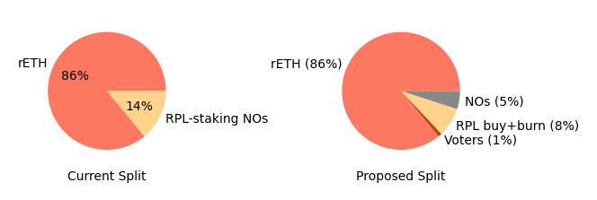
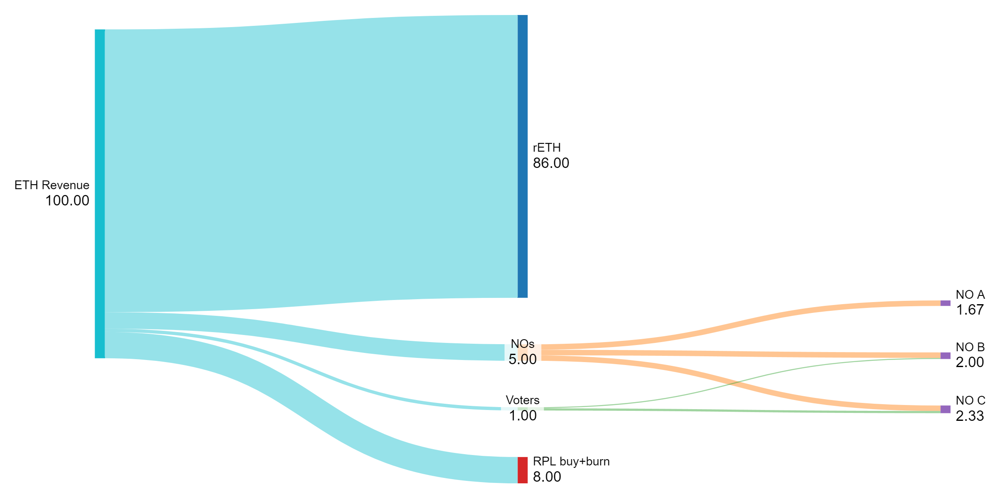

This is a snapshot of https://github.com/Valdorff/rp-thoughts/blob/main/2024_02_strategy/readme.md for the RPIPs repository. 

----

## Table of Contents
1. [Motivation](#motivation)
2. [Core concept](#core-concept)
   1. [Smaller bonds for capital efficiency](#smaller-bonds-for-capital-efficiency)
   2. [RPL revenue for value capture](#rpl-revenue-for-value-capture)
      1. [Flow diagram examples](#flow-diagram-examples)
3. [Required support](#required-support)

## Choose your depth
This document is the top tier of importance.

I don't recommend moving on to others until you feel comfortable with the concepts in this document.
- [Top tier](readme.md)
- [Tier 2](readme_tier2.md)
- [Tier 3](readme_tier3.md)

## Motivation
Let's start with desired end state:
- We're trying to make pure ETH NOs compare favorably vs competitors (eg, Lido CSM) starting at some minimum level of bonded ETH
  - This depends on NO commission % on borrowed ETH
  - This depends on borrowed ETH per bonded ETH
- We're trying to attract enough rETHers to get us to desired market share
- We're trying to capture all surplus value in RPL

## Core concept

### Smaller bonds for capital efficiency
We'll start by determining a good NO commission % using the aggressive-alt bond curve I [described](../2023_11_rapid_research_incubator/bond_curves.md). The summary of that idea is that we can allow smaller ETH bonds safely by enabling MEV theft penalties across a whole node (multiple minipools); smaller ETH bonds make us dramatically more capital efficient. The proposed bond curve requires the first two minipools to have a 4-ETH bond, and allows subsequent minipools to have a 1.5-ETH bond. 

Remember for context that the proposed [Lido CSM ROI](https://research.lido.fi/t/bond-and-staking-fee-napkin-math/5999) is 1.5 (`solo_apy * (4*0.9+32*0.075)/4 = 1.5 * solo_apy`). Here is RP capital efficiency with 3%/4%/5% of commission on borrowed ETH going to NOs:

We see that 5% commission competes favorably with Lido CSM starting at ~11 ETH bonded (2 4-ETH minipools and 2 1.5-ETH minipools). At high bonds, we do significantly better. Even 3% was able to beat out Lido CSM (starting at 30.5 ETH, aka 2 4-ETH minipools and 15 1.5 ETH minipools). That said, I explicitly would like to err on the side of growth, so I propose using 5%.

### RPL value capture
Since total rETH commission is much higher (per bonded ETH) with these lower bonds, Node Operation can be more than competitive as shown above. The surplus revenue is used two ways:
- One slice is directed to RP voters. See [tier2](readme_tier2.md#voter-share-thoughts) for details
- The remainder is made available for RPL buy+burn. See [tier2](readme_tier2.md#rpl-buyburn) for details

The value captured by RPL is `(voter_share + rpl_buy_and_burn_share) * total_borrowed_eth_revenue`. In other words, self-interested holders are looking for the value of `rpl_buy_and_burn_share` that (a) maximizes value capture and (b) meets our [self-limiting obligations](https://rpips.rocketpool.net/RPIPs/RPIP-17). This is nice because it means that voters will likely have an incentive to make rETH attractive (to increase `total_borrowed_eth` and thus its revenue), even if it means they take a smaller share of the pie; this is a canonical example of a positive-sum game -- RPL voters can essentially opt to have a smaller slice of a bigger pie via vote.

#### Flow diagram examples
This view goes 1 step past the pie chart to show what individual users receive.

Let's walk through this. There are 4 users:
- NO A: stakes 4 ETH and 0 RPL
- NO B: stakes 4 ETH and 3 ETH worth of RPL
- NO C: stakes 4 ETH and 10 ETH worth of RPL
- RPL holder D: holds 4 ETH worth of RPL

Now let's follow the flows:
- Stage 1: We have 100% of the ETH staking revenue from rETH's ETH
- Stage 2: We split that up per the pie chart
- Stage 3:
  - Ethereum-bonded Node Operators get 5% commission on the borrowed ETH they support on the validators they run
  - Voters get a share of revenue from all borrowed ETH in the protocol, based on the amount of effective RPL for voting they have (`weight = min(rpl_to_reach_150pct_of_bonded ETH, staked_rpl)`)
  - RPL holders (staked and nonstaked) benefit from market buy-side market demand from the RPL buy+burn

Now let's illustrate one more thing. Here we've grown our revenue 5x by onboarding a bunch of ETH-only stakers.
There are 16 users:
- 13x [NO A stakes 4 ETH and 0 RPL]
- NO B stakes 4 ETH and 100 RPL
- NO C stakes 4 ETH and 400 RPL
- RPL Holder D holds 400 RPL

Again, let's follow the flows:
- Stage 1: We're showing revenue as 500% (to keep the relative revenue unit the same in both flow diagrams)
- Stage 2: We split that up per the pie chart
- Stage 3:
  - Ethereum-bonded Node Operators get 5% commission on the borrowed ETH they support on the validators they run; note that these numbers are the same as in the chart above
  - Voters get a share of revenue from all borrowed ETH in the protocol, based on the amount of effective RPL for voting they have.
    - Since the revenue has 5xed, but we have the same voters, the voters each get 5x the rewards
  - RPL holders benefit from the RPL buy+burn
    - Since the revenue has 5xed, this benefit has 5xed as well

The key takeaways here are that the Ethereum portion stays equally attractive -- you get the same ROI as above. The voter and RPL buy+burn portions, however, get 5x as attractive. RPL's success is very directly tied into the success of the protocol and the TVL that it's able to attract to rETH. 

For simplicity, I've made all ETH users have a single 4-ETH pool. Note that it really doesn't matter for this view: even if they have a mix of 4-ETH and lower bond pools, the _share_ of the revenue based on borrowed ETH will get split the same way. The NOs would, ofc, get better ROI as their bonded ETH per borrowed ETH ratio decreases.

## Required support
- Universal Variable Commission
  - The portion going to NOs and RPL stakers should be settable by vote. rETH's portion is simply 100% minus those two portions 
  - This should apply across all possible minipools (noting there's some limitations around currently existing ones)
  - I don't believe these need to be changed often enough that we benefit significantly from automating it, at least not in the short term
- Megapools
  - Megapools are a single deployed contract that is used as the Ethereum withdrawal address for many validators. This contrasts with minipools, which have one contract per validator. Because it's one contract, we can avoid initial deployment costs per validator, have lower ongoing gas costs to distribute rewards, etc.
  - Gas becomes increasingly problematic as pool size decreases (since a Node operator has more validators for the same invested ETH). This bails us out.
  - Megapools require a planned Ethereum level upgrade b/c they need to be able to verify beacon chain data. 
- Forced exits
  - Aka, execution layer exits. This feature allows the execution layer to request an exit from the Ethereum withdrawal address of a validator. For us that's the minipool/megapool contract. Here I'm suggesting one programmatic situation where it would be used.
  - Critical to protect against loss scenarios associated with MEV theft and abandonment
  - Exit a validator when an NO's `(total_leakage + debt) >0.5 ETH`; this is about enough for ~3 months covering leakage and debt to rETH at 4% apy: `32*.04*(6/12)*1.645 = .526 ETH`
    - The debt variable could be used for underperformance penalties and MEV penalties
    - Note that we can kick one minipool at a time here, which yields a ~1.5 ETH credit.
  - Execution layer exits require a planned Ethereum level upgrade.